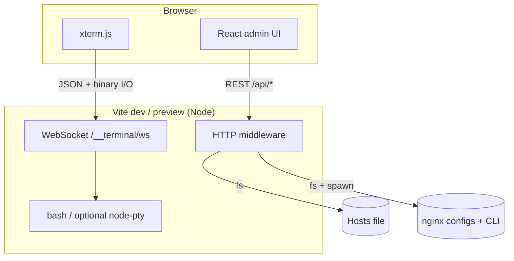

```
╔══════════════════════════════════════════╗
║                                          ║
║   ██████╗ ███████╗██╗   ██╗              ║
║   ██╔══██╗██╔════╝██║   ██║              ║
║   ██║  ██║█████╗  ██║   ██║              ║
║   ██║  ██║██╔══╝  ╚██╗ ██╔╝              ║
║   ██████╔╝███████╗ ╚████╔╝   ███╗   ███╗ ║
║   ╚═════╝ ╚══════╝  ╚═══╝    ╚══╝   ╚══╝ ║
║                        M A N A G E R     ║
╚══════════════════════════════════════════╝

```

### Your machine. One dashboard. Zero context switching.

**Hosts · nginx · shell — wired through Vite, rendered in React.**


**[Clone](https://github.com/mj-manna/dev-manager.git)** · **[Issues](https://github.com/mj-manna/dev-manager/issues)** · **[Pull requests](https://github.com/mj-manna/dev-manager/pulls)**

If this saves you time, consider leaving a star — it helps others discover the project.


  


## Table of contents


|                                                   |                                  |
| ------------------------------------------------- | -------------------------------- |
| [Why Dev Manager?](#why-dev-manager)              | Motivation and fit               |
| [Feature spotlight](#feature-spotlight)           | What ships out of the box        |
| [Architecture](#architecture)                     | How the pieces connect           |
| [Quick start](#quick-start)                       | Clone, install, run              |
| [Scripts & port](#scripts--port)                  | `dev` / `build` / `preview`      |
| [API and terminal](#api-and-terminal-reference)   | Endpoints and hooks              |
| [Optional: full PTY](#optional-full-pty-node-pty) | Better sudo / interactive shells |
| [Project layout](#project-layout)                 | Where files live                 |
| [Security](#security)                             | Local-first expectations         |
| [Contributing](#contributing)                     | PR-friendly workflow             |
| [License](#license)                               | MIT                              |


  


---

## Why Dev Manager?


|     |
| --- |
|     |


**The problem**

- Juggling `/etc/hosts`, nginx site configs, and a terminal across three windows  
- `apt` / `dnf` failing in headless scripts because **sudo** wants a real TTY  
- Yet another generic “admin template” that does not touch your **actual** dev machine


**The approach**

- One **modern admin shell** (sidebar, panels, tabs) built with **React 19**  
- **Vite plugins** expose safe, local HTTP + WebSocket surfaces — no separate backend repo  
- **Browser terminal** (xterm) so passwords and prompts stay **interactive**


> **Heads-up:** Dev Manager is a **local development tool**. It is powerful because it runs **as you** on the box that runs Vite. It is not a multi-tenant cloud product.

  


---

## Feature spotlight

**Dashboard & navigation** — click to collapse

  


|     | Feature                | Notes                                                       |
| --- | ---------------------- | ----------------------------------------------------------- |
| 1   | **Grouped sidebar**    | Workspace · Environment · Web Server · Account              |
| 2   | **Responsive layout**  | Drawer + backdrop on small screens; full sidebar on desktop |
| 3   | **Theme-aware chrome** | Light / dark follows `prefers-color-scheme`                 |


**Environment → Host editor**

  


- Reads and writes the **system hosts file** with OS-aware paths (**Windows** / **Linux** / **macOS**).  
- **GET/PUT** `/api/hosts` — JSON in/out; elevated permissions behave like editing the file on disk.


**Web Server → Nginx**

  


- Detects whether **nginx** is installed and surfaces **version** + **config root**.  
- **Tabbed virtual host editor** — Debian `sites-available` / `sites-enabled` or `conf.d/*.conf`.  
- **Create** new site files, **save**, run `**nginx -t`**, **restart** service (platform-specific).  
- **Install** flow fetches `**GET /api/nginx/install-command`** and runs it in the **in-app terminal** (so `sudo` and apt locks work like a normal shell).


**Global in-app terminal**

  


- **WebSocket** shell at `/__terminal/ws` — type commands, passwords, and confirmations **in the browser**.  
- React hook `**useTerminal()`** with `runInTerminal()`, `showTerminal()`, `hideTerminal()`, `toggleTerminal()`.  
- **Resize** the drawer; see **exit codes** when the shell session ends.


  


---

## Architecture




| Layer                   | Responsibility                                                         |
| ----------------------- | ---------------------------------------------------------------------- |
| **React**               | Navigation, forms, nginx tabs, terminal drawer                         |
| **Vite plugins**        | Implement `/api/hosts`, `/api/nginx/*`, upgrade handling for the shell |
| **ws + xterm**          | Full-duplex terminal streaming                                         |
| **Optional `node-pty`** | Real pseudo-terminal for demanding interactive programs                |


  


---

## Quick start

```bash
git clone https://github.com/mj-manna/dev-manager.git
cd dev-manager
```


| pnpm (recommended) | npm |
| ------------------ | --- |
|                    |     |

```bash
pnpm install
pnpm dev
```

```bash
npm install
npm run dev
```

(Bun works too: `bun install` / `bun run dev`.)


Then open **[http://localhost:9999](http://localhost:9999)** (see `vite.config.ts` to change the port).

  


---

## Scripts & port


| Command                               | What it does                                  |
| ------------------------------------- | --------------------------------------------- |
| `pnpm dev` / `npm run dev`             | Dev server + APIs + terminal WebSocket        |
| `pnpm build` / `npm run build`         | `tsc -b` then Vite production build → `dist/` |
| `pnpm preview` / `npm run preview`     | Static preview; plugins still attach          |
| `pnpm lint` / `npm run lint`           | ESLint across the repo                        |


  


---

## API and terminal reference

`/api/hosts`


| Method | Description                                     |
| ------ | ----------------------------------------------- |
| `GET`  | `{ path, platform, content, writable }`         |
| `PUT`  | Body `{ "content": "..." }` — writes hosts file |


`/api/nginx/`* (selection)


| Method        | Path                         | Purpose                                  |
| ------------- | ---------------------------- | ---------------------------------------- |
| `GET`         | `/api/nginx/status`          | Installed?, version, roots, vhost list   |
| `GET`         | `/api/nginx/install-command` | Suggested shell install line for this OS |
| `GET`         | `/api/nginx/vhosts`          | Refresh vhost list                       |
| `GET` / `PUT` | `/api/nginx/vhosts/:id`      | Read / write one file                    |
| `POST`        | `/api/nginx/vhosts`          | Create file `{ name, content? }`         |
| `POST`        | `/api/nginx/test`            | `nginx -t` result                        |
| `POST`        | `/api/nginx/restart`         | Restart nginx (best effort per OS)       |


WebSocket `/__terminal/ws`

Client sends JSON messages such as:

```json
{ "type": "resize", "cols": 120, "rows": 32 }
{ "type": "input", "data": "ls -la\n" }
{ "type": "run", "command": "sudo apt update" }
```

Server streams **binary** terminal output and occasional **JSON** control messages (`ready`, `exit`). Keep the path aligned with `src/terminal/constants.ts`.


  


---

## Optional full PTY (`node-pty`)

Without native **node-pty**, the app falls back to a **piped** shell — enough for many tasks, but some **sudo** flows expect a TTY.

**Debian / Ubuntu example**

```bash
sudo apt install build-essential
pnpm add node-pty
pnpm dev
```

> On macOS, install **Xcode Command Line Tools** before `pnpm add node-pty`.

  


---

## Project layout

```
dev-manager/
├── src/
│   ├── App.tsx
│   ├── components/          # HostEditor, NginxPanel, …
│   ├── terminal/            # Provider, pane, WS client, constants
│   ├── main.tsx
│   └── …
├── vite-plugin-hosts-api.ts
├── vite-plugin-nginx-api.ts
├── vite-plugin-terminal-ws.ts
├── vite.config.ts
├── README.md
└── package.json
```

  


---

## Security

- Treat this like **remote code execution as your user**: same privileges as the account running Vite.  
- Bind to **localhost** in untrusted networks; do not port-forward blindly.  
- For anything beyond local dev, add **auth**, **TLS**, and a hardened reverse proxy.

  


---

## Contributing

We love thoughtful PRs.

1. **Fork** [mj-manna/dev-manager](https://github.com/mj-manna/dev-manager)
2. Branch from `main` — `feat/…`, `fix/…`, or `chore/…`
3. `pnpm lint` (or `npm run lint`) — keep the tree green
4. Open a PR with a **clear description** and, when relevant, **screenshots** or **screen recordings**

  


---

## License

MIT © **[mj-manna](https://github.com/mj-manna)** — see `[LICENSE](LICENSE)` in the repository.

  


---


### Built for developers who live in the terminal — but want a prettier cockpit.

[⭐ Star on GitHub](https://github.com/mj-manna/dev-manager)  ·  [🐛 Report an issue](https://github.com/mj-manna/dev-manager/issues)  ·  [⬆ Back to contents](#table-of-contents)

Repository: `https://github.com/mj-manna/dev-manager.git`

